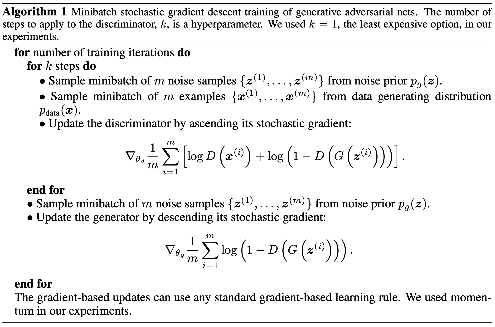
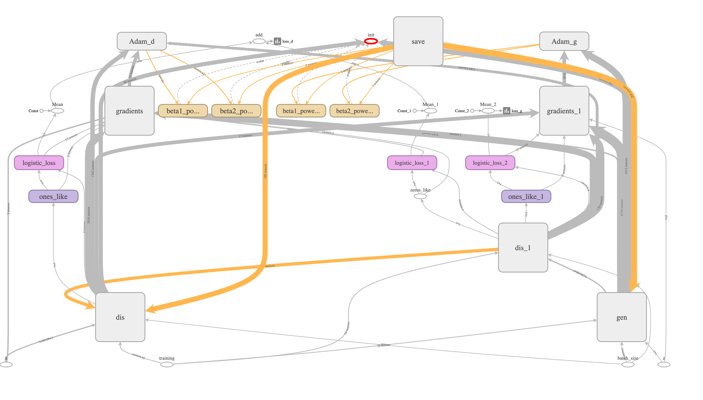
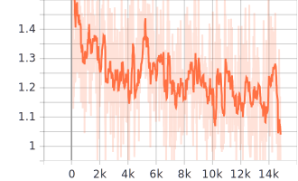
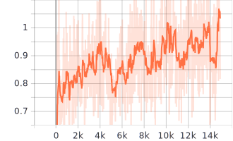
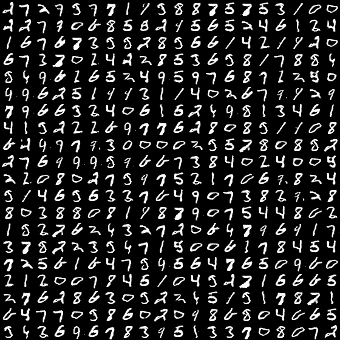
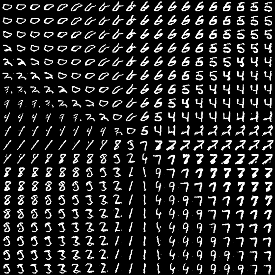
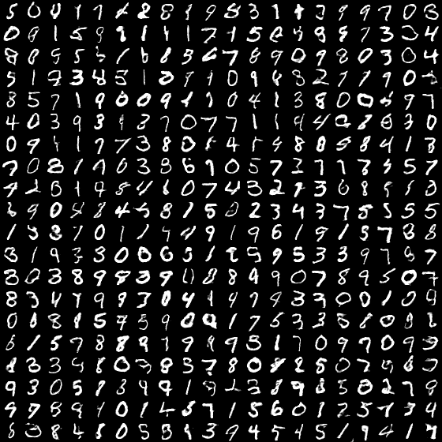
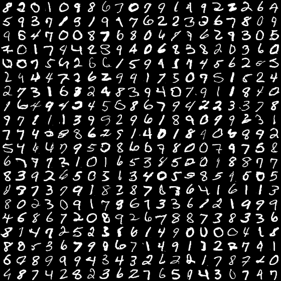

[TensorFlow] Generative Adversarial Nets (GAN)
=====

TensorFlow implementation of Generative Adversarial Networks (GAN) with MNIST dataset.  

## Architecture

### Training algorithm

    
  
The algorithm for training GAN [1].

### GAN architecture

    
  
The architecture of GAN [1].

### Graph in TensorBoard

    
  
Graph of GAN.

## Results

### Training Procedure

  

    
    
  

  
Loss graph in the training procedure.   Each graph shows loss of the discriminator and loss of the generator respectively.

### Test Procedure
|z:2|z:2 (latent space walking)|
|:---:|:---:|
|||

|z:64|z:128|
|:---:|:---:|
|||

## Environment
* Python 3.7.4  
* Tensorflow 1.14.0  
* Numpy 1.17.1  
* Matplotlib 3.1.1  
* Scikit Learn (sklearn) 0.21.3  

## Reference
[1] Ian Goodfellow et al. (2014). <a href="http://papers.nips.cc/paper/5423-generative-adversarial-nets">Generative Adversarial Nets</a>. NIPS (NeurIPS).  
