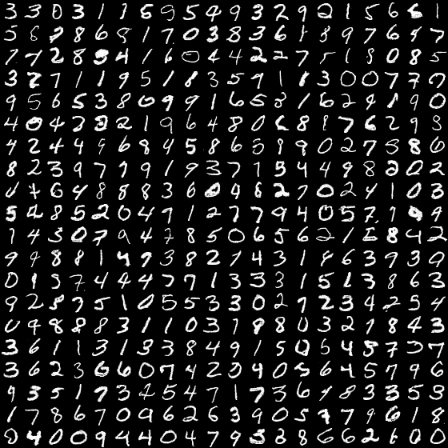

[TensorFlow] Generative Adversarial Nets (GAN)
=====

## Architecture

    
  
The algorithm for training GAN [1].

    
  
The architecture of GAN [1].

## Results

    
  
The graph of GAN [1].

|z:2|z:2 (latent space walking)|z:64|
|:---:|:---:|:---:|
||||

## Environment
* Python 3.7.4  
* Tensorflow 1.14.0  
* Numpy 1.17.1  
* Matplotlib 3.1.1  
* Scikit Learn (sklearn) 0.21.3  

## Reference
[1] Ian Goodfellow et al. (2014). <a href="http://papers.nips.cc/paper/5423-generative-adversarial-nets">Generative Adversarial Nets</a>. NIPS (NeurIPS).  
